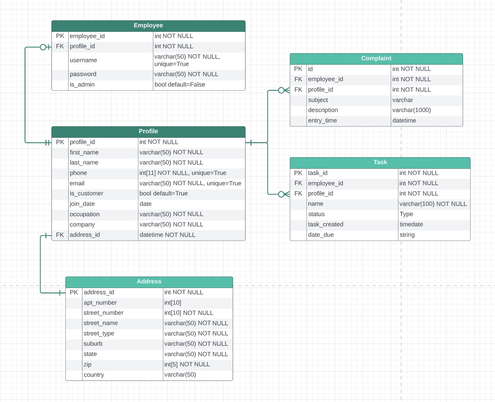

# LizetteDimalanta_T2A2

## API Web Server

### Customer Relationship Management (CRM) API Web Server for Freelancers

## Repository

[LizetteDimalanta_T2A2](https://github.com/Lizette-Dimalanta/LizetteDimalanta_T2A2)

## API Installation Instructions

1. Run your terminal application
2. Git clone the CRM API github repository
3. Create a virtual environment:
   `python3 -m venv .venv && source .venv/bin/activate`
4. Install requirements.txt:
   `pip install -r requirements.txt`
5. Remove 'sample' text from .env.sample:
   `.env.`
6. Run psql, create and setup a new database:
   `psql`
7. Generate and enter your JWT key and setup database URL
8. Create tables using command:
   `flask db create && flask db seed`
9. Activate flask using command:
    `flask run`

## Q1

### **Identification of the _problem_ you are trying to solve by building this particular _app_.**

Customer Relational Management tools (CRMs) are an essential tool to manage, prioritise and track your business' interactions with clients/customers and stakeholders. From freelancers and small business owners to large enterprises, a CRM is the essential key to handling and strengthening customer relationships.

From my experience in working with small businesses, finding the right CRM tool for your business can be tough - where some may have to seek multiple tools (such as Monday, Notion and Asana) to create the optimal managerial customer-relationship system.
Because of this, CRMs are often customised according to a businesses' needs through web development, with the collaboration of input from owner/s, stakeholders and management.

I have built a customised, high-level CRM API web server for this purpose, and to create the foundation for freelancers (and small businesses) to build upon and customise to their needs.

## Q2

### **Why is it a _problem_ that needs solving?**

Using multiple management tools from third-party services can get the job done, but in turn has inefficiencies that can slow down a company's customer pipeline and ultimately disrupt an important client relationship through simple confusion and miscommunication.

Building custom CRMs are most commonly seen in larger enterprise settings, where businesses handling a larger sum of clients and stakeholders require a more customised CRM to more effectively handle their client/stakeholder database.

**Benefits to using a customised CRM:**

- Maximises productivity and management processes:
  - More straightforward and easier to navigate (especially during onboarding).
  - Includes features and functionality specifically designed for the business' maximum efficiency.
- Expedites team workflow through customised management features.
- Faults/bugs in the CRM can be handled internally and immediately.
- Stricter encryption and authentication methods can be used to strengthen data security.
- Database is locally managed - Privileges and access of this database can be managed according to role, reducing the risk of data inaccuracy and inconsistency.

However, custom development is not cheap. It may be a high cost for a small business or freelancer to fund developers to create a customised CRM (hence why this is implemented more on larger-scaled enterprises). Due to this, I have built the foundations of a CRM API web server to lessen the time and costs for the development process when built upon as a full-scale web app.

## Q3

### **Why have you chosen this database system. What are the drawbacks compared to others?**

As freelancers' needs for a CRM differ between industries, this project is built to provide the core  foundation that is later built upon accordingly, to accommodate the extra features required for the CRM's full efficiency for their work. In this case, the Relational Database Management System (RDBMS) used for this project is **PostgreSQL** - a flexible object-relational database management system that allows **full extendability** in the growth of this application.

**Pros:**

- Allows for **inheritance** and **function overloading**, and has the ability to process **complex datatypes**.
- **Great language support:** Supporting several languages such as **Python**, **Java** and **C++**.
- **Open-source:** Allows full flexibility in using, modifying or creating **modular** **applications**.
- Highly **flexible** and **expandable**.
- Data security: Allows for strong data security and file protection through access control and the availability of several encryption connection options.

**Cons**:

- **Speed**: PostgreSQL has a slower runtime due to its prioritisation of compatibility.
- PostgreSQL documentation is only available in English.

## Q4

### **Identify and discuss the key functionalities and benefits of an ORM**

An Object Relational Mapper (ORM) is a software tool that give developers the ability to interact with relational databases like SQL, using object-oriented programming languages like Python, PHP and .NET. This CRM project is buit upon SQLAlchemy, a high-performance ORM tool that optimises database access.

**Advantages:**

- Using an ORM can save up to 20-50% of a developer's overall development time.
- ORM tools use code templates, setting the design patterns standards for other developers to allow for better consistency.
- Reduces testing times dramatically as code templates are tested by the software vendor and other developers.

## Q5

### **Document all endpoints for your API**

---

### **Profile Routes**

`/profiles/`

**Methods**: `['POST']`

- **Arguments**: None
- **Description**: Allows authorised user to create a new profile
- **Authentication**: `@jwt_required()`
- **Authorisation**: `authorize()` required
- **Request Body**: `first_name`, `last_name`, `phone`, `email`, `is_customer`, `occupation`

**Methods**: `['GET']`

- **Arguments**: None
- **Description**: Returns JSON list of all available profiles
- **Authentication**: `@jwt_required()`
- **Authorisation**: `authorize()` required
- **Request Body**: None

`/profiles/<int:id>/`

**Methods**: `['GET']`

- **Arguments**: `profile_id` of requested profile
- **Description**: Allows authorised user to retrieve a profile associated to specified `profile_id`
- **Authentication**: `@jwt_required()`
- **Authorisation**: `authorize()` required
- **Request Body**: None

**Methods**: `['PUT','PATCH']`

- **Arguments**: `profile_id` of profile to update
- **Description**: Allows authorised user to update a profile associated to specified `profile_id`
- **Authentication**: `@jwt_required()`
- **Authorisation**: `authorize()` required
- **Request Body**: Include either of the following to update - `first_name`, `last_name`, `phone`, `email`, `is_customer`, `join_date`, `occupation`

**Methods**: `['DELETE']`

- **Arguments**: `profile_id` of profile to delete
- **Description**: Allows authorised user to delete a profile associated to specified `profile_id`
- **Authentication**: `@jwt_required()`
- **Authorisation**: `authorize()` required
- **Request Body**: None

---

### **Address Routes**

`/addresses/`

**Methods**: `['POST']`

- **Arguments**: None
- **Description**: Allows authorised user to create a new address
- **Authentication**: `@jwt_required()`
- **Authorisation**: `authorize()` required
- **Request Body**: `apt_number`, `street_number`, `street_name`, `suburb`, `state`, `zip`, `country`

**Methods**: `['GET']`

- **Arguments**: None
- **Description**: Returns JSON list of all available addresses
- **Authentication**: `@jwt_required()`
- **Authorisation**: `authorize()` required
- **Request Body**: None

`/addresses/<int:id>/`

**Methods**: `['GET']`

- **Arguments**: `address_id` of requested address
- **Description**: Allows authorised user to retrieve an address associated to specified `address_id`
- **Authentication**: `@jwt_required()`
- **Authorisation**: `authorize()` required
- **Request Body**: None

**Methods**: `['PUT','PATCH']`

- **Arguments**: `address_id` of address to update
- **Description**: Allows authorised user to update an address associated to specified `address_id`
- **Authentication**: `@jwt_required()`
- **Authorisation**: `authorize()` required
- **Request Body**: Include either of the following to update - `apt_number`, `street_number`, `street_name`, `suburb`, `state`, `zip`, `country`

**Methods**: `['DELETE']`

- **Arguments**: `address_id` of address to delete
- **Description**: Allows authorised user to delete an address associated to specified `address_id`
- **Authentication**: `@jwt_required()`
- **Authorisation**: `authorize()` required
- **Request Body**: None

---

### **Employee (Auth) Routes**

`/auth/register/`

**Methods**: `['POST']`

- **Arguments**: None
- **Description**: Allows authorised user to create a new Employee, Profile and Address instance
- **Authentication**: `@jwt_required()`
- **Authorisation**: `authorize()` required
- **Request Body**:
  - Employee: `username`, `password`, `is_admin`
  - Profile: `first_name`, `last_name`, `phone`, `email`, `is_customer`, `join_date`, `occupation`
  - Address: `apt_number`, `street_number`, `street_name`, `suburb`, `state`, `zip`, `country`

`/auth/login/`

**Methods**: `['POST']`

- **Arguments**: None
- **Description**: Login route to initiate token (authorise and authenticate)
- **Authentication**: None
- **Authorisation**: None
- **Request Body**: `username`, `password`

---

### **Complaints Routes**

`/complaints/`

**Methods**: `['POST']`

- **Arguments**: None
- **Description**: Creates a new complaint instance
- **Authentication**: None
- **Authorisation**: None
- **Request Body**: `subject`, `description`, `profile_id`, `employee_id`

**Methods**: `['GET']`

- **Arguments**: None
- **Description**: Returns JSON list of all available complaints
- **Authentication**: None
- **Authorisation**: None
- **Request Body**: None

`/complaints/<int:id>/`

**Methods**: `['GET']`

- **Arguments**: `complaint_id` of requested complaint
- **Description**: Retrieve a complaint associated to specified `complaint_id`
- **Authentication**: None
- **Authorisation**: None
- **Request Body**: None

**Methods**: `['PUT','PATCH']`

- **Arguments**: `complaint_id` of complaint to update
- **Description**: Update a complaint associated to specified `complaint_id`
- **Authentication**: None
- **Authorisation**: None
- **Request Body**: Include either of the following to update - `subject`, `description`, `profile_id`, `employee_id`

**Methods**: `['DELETE']`

- **Arguments**: `complaint_id` of complaint to delete
- **Description**: Allows authorised user to delete an complaint associated to specified `complaint_id`
- **Authentication**: `@jwt_required()`
- **Authorisation**: `authorize()` required
- **Request Body**: None

---

### **Task Routes**

`/tasks/`

**Methods**: `['POST']`

- **Arguments**: None
- **Description**: Allows authorised user to create a task
- **Authentication**: `@jwt_required()`
- **Authorisation**: `authorize()` required
- **Request Body**: `name`, `status`, `due_date`, `profile`, `employee`

**Methods**: `['GET']`

- **Arguments**: None
- **Description**: Returns JSON list of all available tasks
- **Authentication**: None
- **Authorisation**: None
- **Request Body**: None

`/tasks/<int:id>/`

**Methods**: `['GET']`

- **Arguments**: `task_id` of requested task
- **Description**: Retrieve a task associated to specified `task_id`
- **Authentication**: None
- **Authorisation**: None
- **Request Body**: None

**Methods**: `['PUT','PATCH']`

- **Arguments**: `task_id` of task to update
- **Description**: Update a task associated to specified `task_id`
- **Authentication**: None
- **Authorisation**: None
- **Request Body**: Include either of the following to update - `name`, `status`, `due_date`, `profile`, `employee`

**Methods**: `['DELETE']`

- **Arguments**: `task_id` of task to delete
- **Description**: Allows authorised user to delete a task associated to specified `task_id`
- **Authentication**: `@jwt_required()`
- **Authorisation**: `authorize()` required
- **Request Body**: None

## Q6

### **An ERD for your app**

The following ERD shown below demonstrates the cardinality between all tables in the database.

### Cardinality

**One-to-One Relationships:**

- Address _(one)_ and Profile _(one)_
- Employee _(zero or one)_ and Profile _(one and only one)_

**One-to-Many Relationships:**

- Profile _(one)_ and Complaints _(zero or many)_
- Profile _(one)_ and Tasks _(zero or many)_

## Q7

### **Detail any third party services that your app will use**

`PostgreSQL`: Open-source relational database management system (RDBMS).

`Flask`: Micro-web framework written in `Python`.

`Flask_Bcrypt`: Password hashing function.

`Flask_JWT_Extended`: Adds JSON web token features.

`flask_marshmallow`: Integration layter for `Flask`.

`Flask-SQLAlchemy`: `Flask` extension that adds support for `SQLAlchemy`.

`marshmallow`: ORM/ODM/framework-agnostic library for converting complex datatypes.

`marshmallow-sqlalchemy`: Integrates `Marshmallow` and `SQLAlchemy`.

`pip-review`: Checks for available updates on pip packages.

`psycopg2`: `PostgreSQL` database adapter for `Python`.

`python-dotenv`: Reads key-value pairs from `.env` file and sets as environment variable.

`SQLAlchemy`: Open-source `SQL` toolkit and ORM for `Python`.

## Q8 & Q9

### CRM Models and Database Relations

---

### **Profile Model**

The profile model contains general information about all individuals in the CRM database (employees and customers).

**Attributes:**

`id`: Profile ID.

- Datatype: `Integer`
- Constraints:
  - `primary_key=True`

`first_name`: First name of employee/customer.

- Datatype: `String`
- Constraints:
  - Limit of `50` characters
  - `nullable=False`
- Validation:
  - Minimum length of 1 character
  - Only letters and spaces are allowed

`last_name`: Surname of employee/customer.

- Datatype: `String`
- Constraints:
  - Limit of `100` characters
  - `nullable=False`
- Validation:
  - Minimum length of 1 character
  - Only letters and spaces are allowed

`phone`: Phone number of employee/customer (integer).

- Datatype: `Integer`
- Constraints:
  - `unique=True`
  - `nullable=False`

`email`: Email of employee/customer.

- Datatype: `String`
- Constraints:
  - Limit of `100` characters  
  - `unique=True`
  - `nullable=False`

`is_customer`: Identifies if profile is a customer.

- Datatype: `Boolean`
- Constraints:
  - `default=True`
  - `nullable=False`

`join_date`: Date of profile creation.

- Datatype: `Date`
- Constraints: Null

`occupation`: Occupation of employee/customer.

- Datatype: `String`
- Constraints:
  - Limit of `100` characters  

`company`: Company that employee/customer works with.

- Datatype: `String`
- Constraints:
  - Limit of `100` characters

**Foreign Keys**

Child Schemas:

`employee`: Employee associated with profile (if applicable).

`address`: Address associated with profile.

`complaints`: Complaints associated with profile.

`task`: Tasks associated with profile.

---

### **Address Model**

The address model contains general information about all individuals' addresses in the CRM database (employees and customers).

**Attributes:**

`id`: Address ID.

- Datatype: `Integer`
- Constraints:
  - `primary_key=True`

`apt_number`: Apartment number of employee/customer (if applicable).

- Datatype: `Integer`
- Constraints: Null

`street_number`: Street number of employee/customer's residence.

- Datatype: `Integer`
- Constraints:
  - `nullable=False`

`street_name`: Street name of employee/customer's residence.

- Datatype: `String`
- Constraints:
  - Limit of `100` characters  
  - `nullable=False`
- Validation:
  - Minimum length of 1 character
  - Only letters and spaces are allowed

`suburb`: Suburb of employee/customer's residence.

- Datatype: `String`
- Constraints:
  - Limit of `100` characters
  - `nullable=False`
- Validation:
  - Minimum length of 1 character
  - Only letters and spaces are allowed

`street_type`: Street type of employee/customer's residence.

- Datatype: `String`
- Constraints:
  - Limit of `20` characters
  - `nullable=False`
- Validation:
  - Must be one of the `VALID_STREET_TYPES`:
    - Street
    - Lane
    - Road
    - Boulevard

`state`: State of employee/customer's residence.

- Datatype: `String`
- Constraints:
  - Limit of `20` characters  
  - `nullable=False`
- Validation:
  - Minimum length of 1 character
  - Only letters and spaces are allowed

`zip`: Postcode of employee/customer's residence.

- Datatype: `Integer`
- Constraints:
  - `nullable=False`

`country`: Country of employee/customer's residence.

- Datatype: `String`
- Constraints:
  - Limit of `100` characters
  - `nullable=False`
- Validation:
  - Minimum length of 1 character
  - Only letters and spaces are allowed

**Foreign Keys**

Parent Schema:

`profile`: Profile associated with address.

---

### **Employee Model**

The employee model shown below, contains login information associated with a profile.

`id`: Employee ID.

- Datatype: `Integer`
- Constraints:
  - `primary_key=True`

`username`: Username of the employee.

- Datatype: `String`
- Constraints:
  - `unique=True`
  - `nullable=False`
- Validation:
  - Minimum length of 1 character.

`password`: Password of the employee.

- Datatype: `String`
- Constraints:
  - `nullable=False`

`is_admin`: Identifies if employee is granted admin privileges.

- Datatype: `Boolean`
- Constraints:
  - `default=False`

**Foreign Keys**

Parent Schema:

`profile`: Profile associated with employee.

Child Schemas:

`complaints`: Complaints associated with employee.

`tasks`: Tasks associated with employee.

---

### **Complaint Model**

The complaint model shown below contains information (attributes) about complaints, comments or notes associated with a customer (`profile_id`) and employee.

`id`: Complaint ID.

- Datatype: `Integer`
- Constraints:
  - `primary_key=True`

`subject`: Subject of complaint type.

- Datatype: `String`
- Constraints:
  - Limit of `100` characters
  - `nullable=False`
- Validation:
  - Minimum length of 1 character.

`description`: Description of complaint.

- Datatype: `String`
- Constraints:
  - Limit of `500` characters
- Validation:
  - Minimum length of 1 character.

`entry_time`: Date when complaint was created.

- Datatype: `Date`
- Constraints: Null

**Foreign Keys**

Parent Schema:

`profile`: Profile (customer) associated with complaint.

`employee`: Employee associated with complaint.

### **Task Model**

The task model shown below contains information about tasks associated with an employee.

`id`: Task ID.

- Datatype: `Integer`
- Constraints:
  - `primary_key=True`

`name`: Name of task.

- Datatype: `String`
- Constraints:
  - Limit of `100` characters
  - `nullable=False`
- Validation:
  - Minimum length of 1 character.

`status`: Current status (progress) of task.

- Datatype: `String`
- Constraints:
  - Limit of `20` characters
- Validation:
  - Must be one of the `VALID_STATUSES`:
    - To-Do
    - Done
    - Ongoing
    - Testing
    - Deployed

`task_created`: Date when task was created.

- Datatype: `DateTime`
- Constraints:
  - `nullable=False`

`due_date`: Date when task is due.

- Datatype: `String`
- Constraints: Null
- Validation:
  - Must be in format `DAY, MONTH, YEAR`.

**Foreign Keys**

Parent Schema:

`profile`: Profile (customer) associated with task.

`employee`: Employee associated with task.

## Q10

## **Describe the way tasks are allocated and tracked in your project**

## **Trello Board**

[Trello Board Link](https://trello.com/invite/b/eqHmvlR7/ATTIea4cdb906d29fd210b769b7bd63005918C722C6F/lizettedimalantat2a2)

## **REFERENCES**

Q3)
[Guru99: Introduction to PosgreSQL](https://www.guru99.com/introduction-postgresql.html)

Q4)
[Alachisoft: ORM](https://www.alachisoft.com/resources/articles/orm.html)