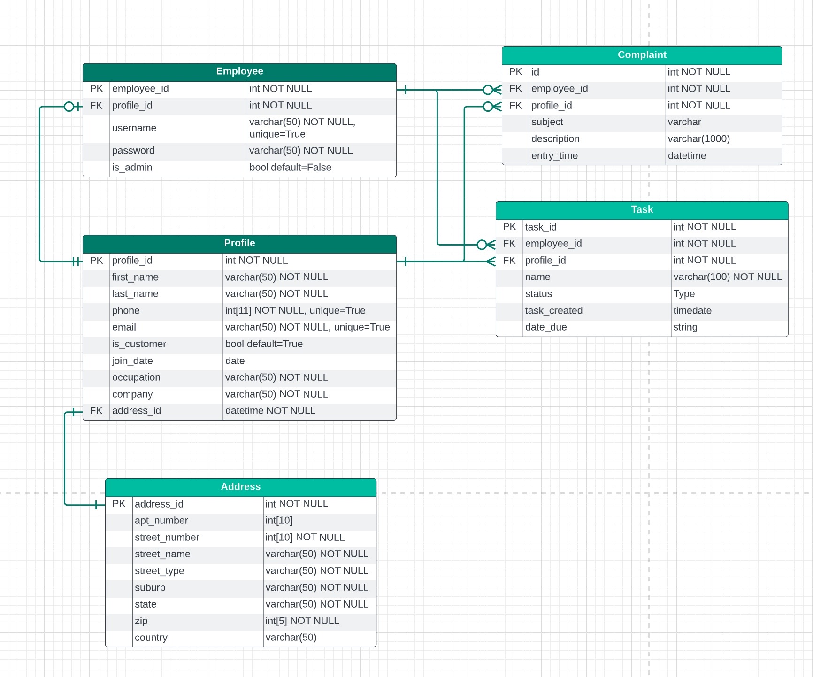
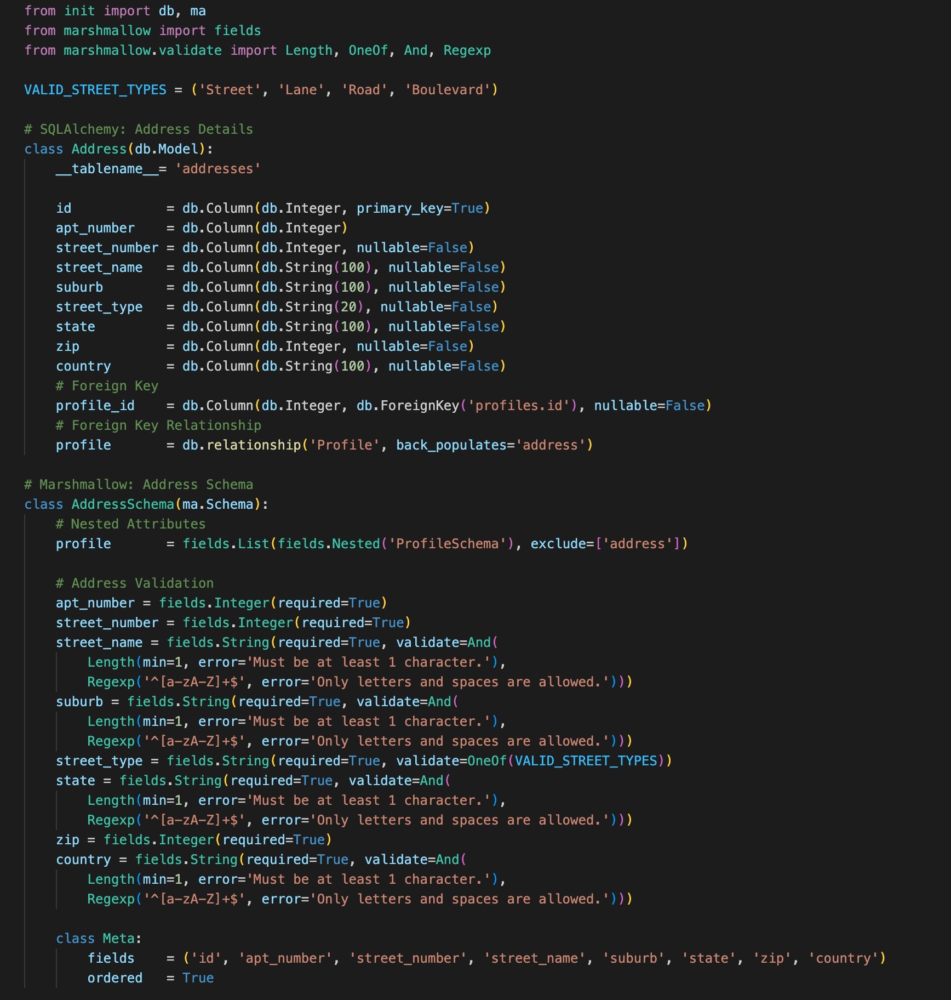
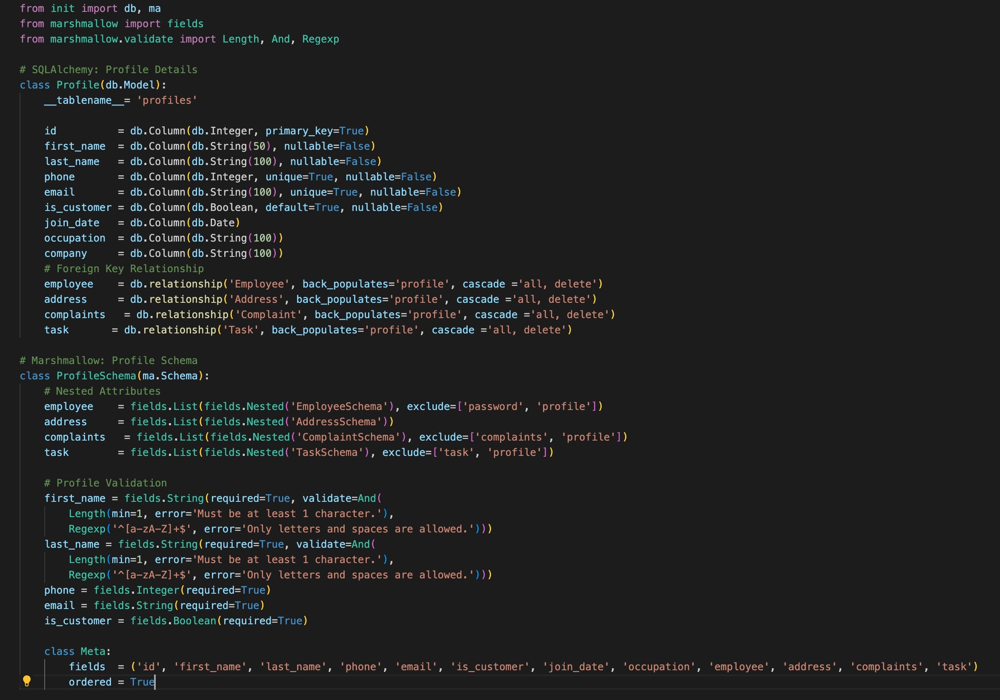
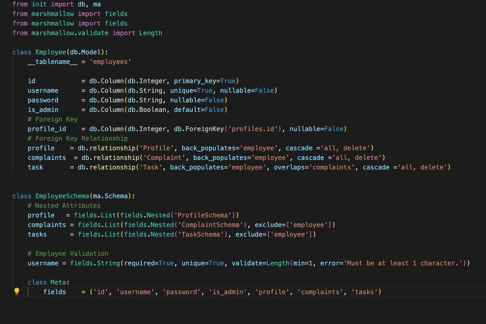
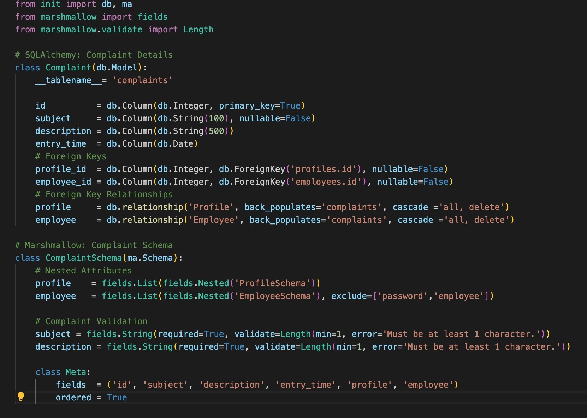
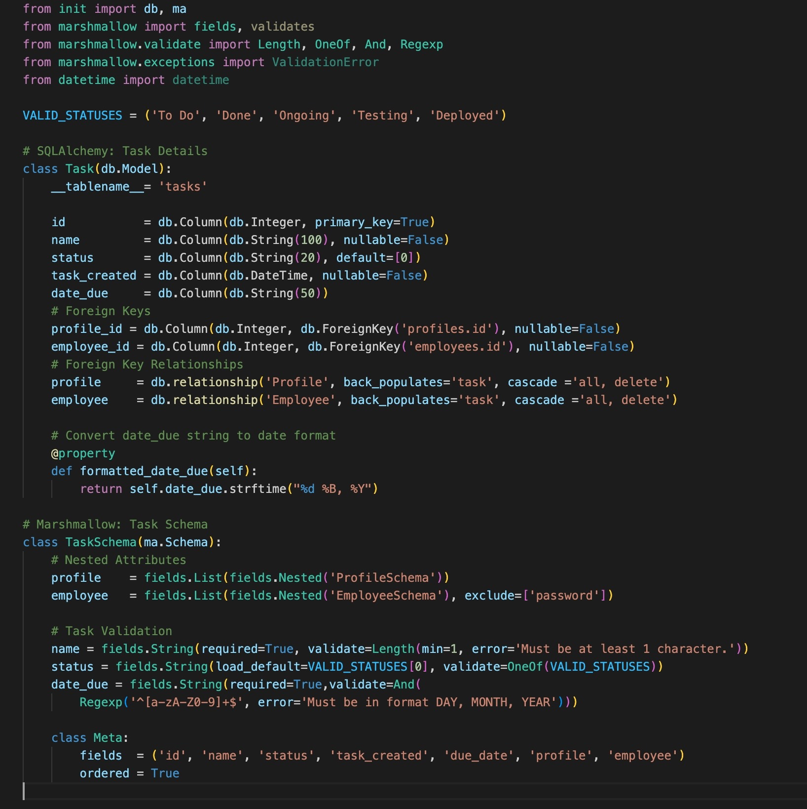

# LizetteDimalanta_T2A2

## API Web Server

### Customer Relationship Management (CRM) API Web Server for Freelancers

## Repository

[LizetteDimalanta_T2A2](https://github.com/Lizette-Dimalanta/LizetteDimalanta_T2A2)

## API Installation Instructions

1. Run your terminal application
2. Git clone the CRM API github repository
3. Create a virtual environment:
   `python3 -m venv .venv && source .venv/bin/activate`
4. Install requirements.txt:
   `pip install -r requirements.txt`
5. Remove 'sample' text from .env.sample:
   `.env.`
6. Run psql, create and setup a new database:
   `psql`
7. Generate and enter your JWT key and setup database URL
8. Create tables using command:
   `flask db create && flask db seed`
9. Activate flask using command:
    `flask run`

## Q1

### **Identification of the _problem_ you are trying to solve by building this particular _app_.**

Customer Relational Management tools (CRMs) are an essential tool to manage, prioritise and track your business' interactions with clients/customers and stakeholders. From freelancers and small business owners to large enterprises, a CRM is the essential key to handling and strengthening customer relationships.

From my experience in working with small businesses, finding the right CRM tool for your business can be tough - where some may have to seek multiple tools (such as Monday, Notion and Asana) to create the optimal managerial customer-relationship system.
Because of this, CRMs are often customised according to a businesses' needs through web development, with the collaboration of input from owner/s, stakeholders and management.

I have built a customised, high-level CRM API web server for this purpose, and to create the foundation for freelancers (and small businesses) to build upon and customise to their needs.

## Q2

### **Why is it a _problem_ that needs solving?**

Using multiple management tools from third-party services can get the job done, but in turn has inefficiencies that can slow down a company's customer pipeline and ultimately disrupt an important client relationship through simple confusion and miscommunication.

Building custom CRMs are most commonly seen in larger enterprise settings, where businesses handling a larger sum of clients and stakeholders require a more customised CRM to more effectively handle their client/stakeholder database.

**Benefits to using a customised CRM:**

- Maximises productivity and management processes:
  - More straightforward and easier to navigate (especially during onboarding).
  - Includes features and functionality specifically designed for the business' maximum efficiency.
- Expedites team workflow through customised management features.
- Faults/bugs in the CRM can be handled internally and immediately.
- Stricter encryption and authentication methods can be used to strengthen data security.
- Database is locally managed - Privileges and access of this database can be managed according to role, reducing the risk of data inaccuracy and inconsistency.

However, custom development is not cheap. It may be a high cost for a small business or freelancer to fund developers to create a customised CRM (hence why this is implemented more on larger-scaled enterprises). Due to this, I have built the foundations of a CRM API web server to lessen the time and costs for the development process when built upon as a full-scale web app.

## Q6

### **CRM ERD**

## Q7

### **Third-Party Services**

- `Flask`
- `Flask_Bcrypt`
- `Flask_JWT_Extended`
- `flask_marshmallow`
- `Flask-SQLAlchemy`
- `marshmallow`
- `marshmallow-sqlalchemy`
- `pip-review`
- `psycopg2`
- `python-dotenv`
- `SQLAlchemy`

## Q8 Cardinality: CRM Models

### Address

### **Profile**

### **Employee**

### **Complaint**

### **Task**

## **Trello Board**

[Trello Board Link](https://trello.com/invite/b/eqHmvlR7/ATTIea4cdb906d29fd210b769b7bd63005918C722C6F/lizettedimalantat2a2)